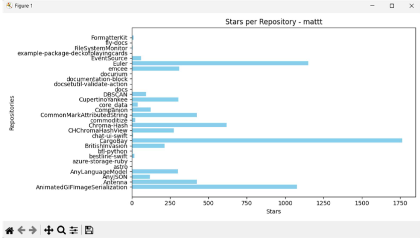
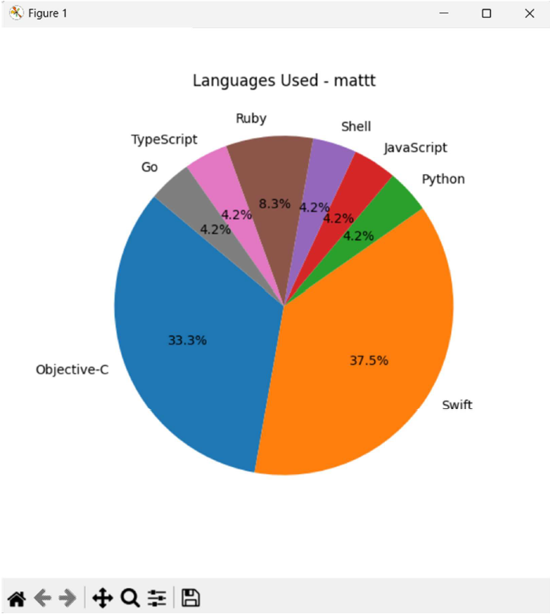

# GitHub Profile Analyzer


GitHub Profile Analyzer is a desktop application developed using **Python** that analyzes public GitHub profiles using the **GitHub REST API**. The application retrieves repository information, visualizes programming language distribution, and presents profile insights through an intuitive graphical interface.

---

## 🚀 Features

- 🔍 Analyze any public GitHub profile
- 📂 Fetch repository information using GitHub REST API
- 📊 Visualize programming language distribution
- 📈 Display repository statistics
- 🖥️ Interactive desktop GUI built with Tkinter
- 📄 Generate PDF reports containing GitHub profile insights

---

## 🛠️ Tech Stack

| Category | Technology |
|----------|------------|
| Language | Python |
| GUI | Tkinter |
| API | GitHub REST API |
| Data Visualization | Matplotlib |
| PDF Generation | ReportLab |
| HTTP Requests | Requests |

---

# 📸 Screenshots

## Home Screen

<p align="center">
  
</p>

---

## Profile Analysis

<p align="center">
  
</p>

---

## Repository Statistics

<p align="center">
  
</p>

---

## ⚙️ Installation

### Clone the repository

```bash
git clone https://github.com/DhruvalRakeshGohil2006/GithubProfileAnalyzer.git
```

### Install dependencies

```bash
pip install -r requirements.txt
```

### Run the application

```bash
python main.py
```

---

## 🔮 Future Enhancements

- GitHub OAuth authentication
- Repository comparison
- Contribution heatmap visualization
- Export reports to Excel
- AI-powered repository recommendations

---

## 👨‍💻 Author

**Dhruval Rakesh Gohil**

- LinkedIn: https://www.linkedin.com/in/dhruval-rakesh-gohil
- GitHub: https://github.com/DhruvalRakeshGohil2006

---

⭐ If you found this project useful, consider giving it a **Star**.
